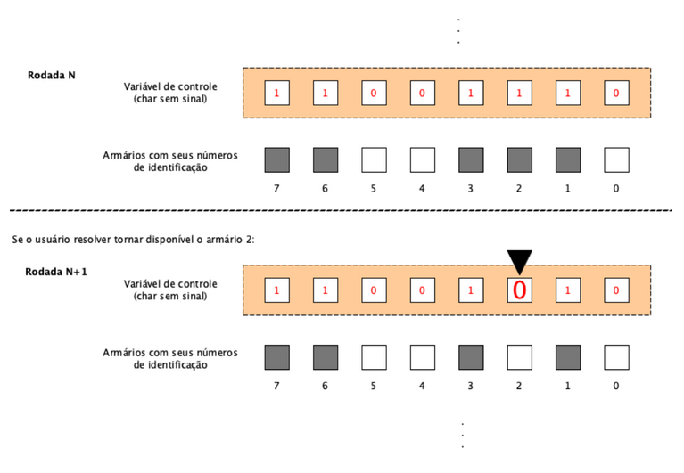

## Desafio 01 - Matheus Matos Rocha

• Imagine que você foi contratado para desenvolver um sistema para gerenciar os armários de alunos de uma universidade. Inicialmente, você terá que fazer uma prova de conceito para 8 armários. Devido às limita̧cões de memória no dispositivo onde seu código será embarcado, você optou por utilizar um mapa de bits. Dessa forma, para cada armário você irá associar um bit, sendo 0 para disponível e 1 para ocupado. Você deverá usar uma UNICA variável do tipo  char sem sinal para controle. Não utilize vetores.

• O sistema funcionará da seguinte forma: Inicialmente, você deve exibir um menu para o usuário com as seguintes opções:

    1. Ocupar armário.
    2. Liberar armário.
    3. Sair.

• Sempre que o usuário digitar a opção 1, você deve escolher um armário aleatoriamente dentre os disponíveis e ocupar, ou seja, colocar o bit correspondente na variável de controle em 1. O programa deve iniciar com todos os armários desocupados. Quando o usuário digitar a opção 2, o programa deve pedir a posição do armário para ser desocupado e colocar o bit correspondente em zero na variável de controle. O programa deve sair quando a opção 3 for a escolhida pelo usuário.

• Observe a ilustração abaixo:

#

#
• Utilize operadores bit-a-bit para ligar e desligar os bits na variável de controle e controlar quais armários estão livres e quais estão ocupados. Não use vetores.

• Para geração de números aleatórios, pesquise sobre a função rand().

• Em cada rodada do programa, apresente os armários que estão ocupados e os que estão livres.

## Desenvolvendo as etapas

### Bibliotecas
 
• Primeiramente, estaremos declarando as seguintes bibliotecas:
    
    #include <stdio.h>
    #include <stdlib.h>
    #include <time.h>  

 ### Função - Utilizada apenas para mostrar o menu de opções
    void Imprimir_Opcoes(){
   
     puts("\n ----- Escolha uma opção ----- ");
     puts("  | (1-) Ocupar armário        | \n");    
     puts("  | (2-) Liberar armário       | \n");
     puts("  | (3-) Sair                  | \n");
     puts("  ------------------------------ \n");
     
     }

### Função - Utilizada para realizar a operação de deslocamento para a esquerda
  
• Nesse contexto, movendo todos os bits de um número especificado  de lugares iniciais para a esquerda. o deslocamento para a esquerda é o equivalente a multiplicar por uma potência de dois:  

    int Bits(int entrada, int NB){
  
    int Mask = (1 << NB);

    return(entrada & Mask);
  
    }
• Após isso, essa função retornará o resultado de uma operação E *(and)*
entre o 1°parâmetro e o 2°parâmetro.

## Função principal - int main ()

### Variáveis

• Devemos criar as Variáveis principais:
   
    unsigned char Verificador = 0, Op = 0;

### 1° Estrutura de repetição

 • Nesse caso, iremos iniciar com uma estrura de repetição do-while. Em que, a mesma foi escolhida por ser válida para rodar a estrutura ao menos uma vez.

    
    29 | do {
           .....
           .....
           .....
    108 | } while ( Op != '3'); 
    
• Em que, a variável utilizada como paramêtro para validar essa estrutura será a Op *(Opção)*.

### Chamado da função para imprimir as opções e pedido para o usuário inserir a opção deseja
    
    Imprimir_Opcoes();
    puts("Selecione uma opção:");
    scanf(" %c", &Op);
           
### Estrutura Switch...Case
  • Essa estrutura será a mais importante do projeto, pois ela classificará as três principais opções da questão Desafio.

     38  | switch (Op) {
     
     40  |  case '1':
           ......
     65  |  case '2':
           ......
     96  |  case '3':
           ......
     102 | default:
           ......
     105 | }

### Case '1' - Switch

  • Antes de tudo, precisamos saber se o caso foi selecionado com sucesso. por isso, precisaremos informar a opção selecionada por meio de uma instrução de saída.

    puts("A opção escolhida - (1) \n");

• Assim, podemos iniciar o processo de gerar os números aleatoriamente.   Em que, irá gerar um numero de 0 a 7, pois são 8 armários.

• Defina um bit (onde (rand() % 8) é o número do bit e 0 é o bit menos significativo): 

    Ex:    1 0 0 0 0 0 0 0
     Verificador |= (1 << 1) = 1 0 0 0 0 0 1 0

 ###  

     srand(time(NULL));
    Verificador |= ( 1 << rand() % 8);

 • Vamos iniciar a impressão do 1° Relatório:

    puts("\n ---  Relatório  --- \n");

### 2° Estrutura de repetição    
• Iremos construir uma estrutura de repetição for, pois irá facilitar a impressão das posição e suas classificações. (Parâmetro é o Contador descente ou *DCont*).

• Já dentro da estrutura, vamos utilizar uma cadeia de condicionais, onde se a função for executada corretamente com os paramêtros *(Verificador, DCont)* retornará que a posição está ocupada, senão caso ela for negada, retornará que a posição está desocupada.

    for( int DCont = 7; 0 <= DCont; DCont--){

        if (Bits(Verificador, DCont)){
          
          printf("A posição %d está ocupada (Escolhida aleatoriamente)\n", DCont);
          
      } else if(!Bits(Verificador, DCont)){
          
         printf("A posição %d está desocupada\n", DCont);

          }  
        }

     puts("\n -------------------- \n");

     break;
      
### Case '2' - Switch

• Antes de tudo, precisamos saber se o caso foi selecionado com sucesso. por isso, precisaremos informar a opção selecionada por meio de uma instrução de saída. Logo após, iremos criar uma  variável para o usuário informar qual posição ele deseja desocupar.

    puts("A opção escolhida - (2) \n");
    
    int Desocupar = 0;
    
    puts("Informe a posição que você quer desocupar:");
    scanf("%d", &Desocupar);

• Além disso, movendo todos os bits de um número especificado de lugares iniciais para a esquerda. o deslocamento para a esquerda é o equivalente a multiplicar por uma potência de dois, nesse caso, iremos negar a proposta:
    
    Verificador &= ~(1 << Desocupar); 

###
    Ex:
      Verificador 1 1 1 1 1 1 1 1
      Verificador &= ~(1 << 1) = 1 1 1 1 1 1 0 1
      Verificador &= ~(1 << 3) = 1 1 1 1 0 1 1 1
      Verificador &= ~(1 << 5) = 1 1 0 1 1 1 1 1

• Vamos iniciar a impressão do 2° Relatório:

    puts("\n ---  Relatório 2  --- \n");

### 3° Estrutura de repetição 
• Iremos construir uma estrutura de repetição for, pois irá facilitar a impressão das posição e suas classificações. (Parâmetro é o Contador descente ou *DCont*).

• Já dentro da estrutura, vamos utilizar uma cadeia de condicionais, onde se a função for executada corretamente com os paramêtros *(Verificador, DCont)* retornará que a posição está ocupada, senão caso ela for negada, retornará que a posição está desocupada.

    for( int DCont = 7; 0 <= DCont; DCont--){

        if (Bits(Verificador, DCont)){
          
          printf("A posição %d está ocupada\n", DCont);
          
      } else if(!Bits(Verificador, DCont)){

         printf("A posição %d está desocupada\n", DCont);

          }  
        }
           
     break;
      
### Case '3' - Switch
• Antes de tudo, precisamos saber se o caso foi selecionado com sucesso. por isso, precisaremos informar a opção selecionada por meio de uma instrução de saída. 

    puts("A opção escolhida - (3) \n");

• Se o usuário selecionar 3, o programa apenas será encerrado, de acordo com as regras estabelecidas pela questão desafio.

     case '3':

         puts("A opção escolhida - (3) \n");
     
    break;

###

### Case 'default' - Switch
• Nessa opção, todos os valores digitados pelo usuário fora do escopo de opção será uma entrada inválida e o programa retornará ao usuário a função *imprimir_Opcoes* para o mesmo verificar novamente as opções disponiveis.

    .....
    default:

     printf("Opção inválida\n");
     Imprimir_Opcoes();     
    }

### Finalização do programa
• Após á finalização do programa, será exibida no console a mensagem de finalização do programa.
  

    ......
   
    puts("Finalizado com sucesso!!! \n");

      return 0;
      
    }

## Link de acesso

[Programa - Repl.it](https://replit.com/@MatheusMatos6/Desafio-1#main.c)

## Fontes de pesquisa

https://www.bogotobogo.com/cplusplus/quiz_bit_manipulation.php

https://www.youtube.com/watch?v=bgA5p-jVros&ab_channel=ProfessorRafaelIvo

